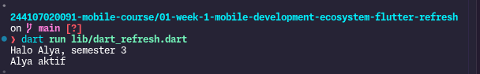
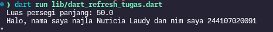
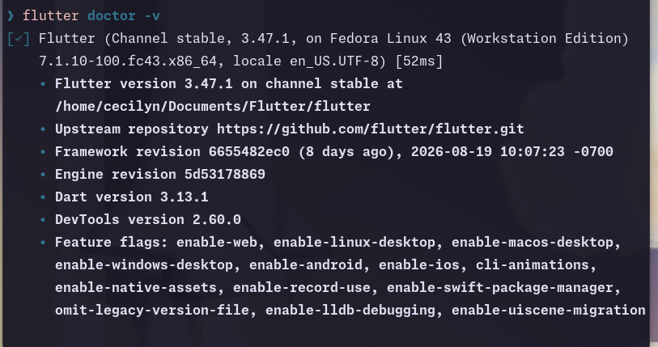
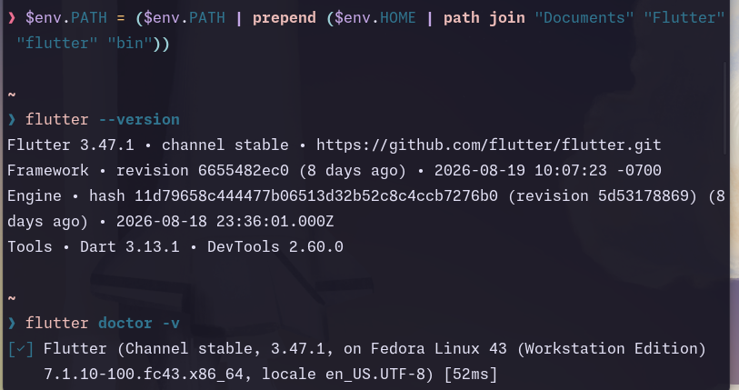
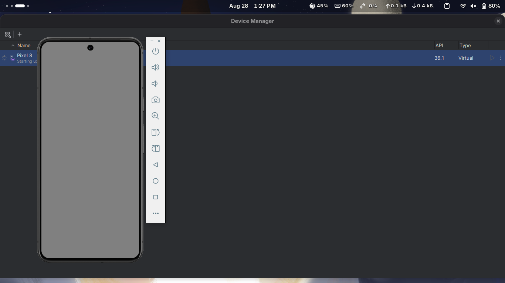
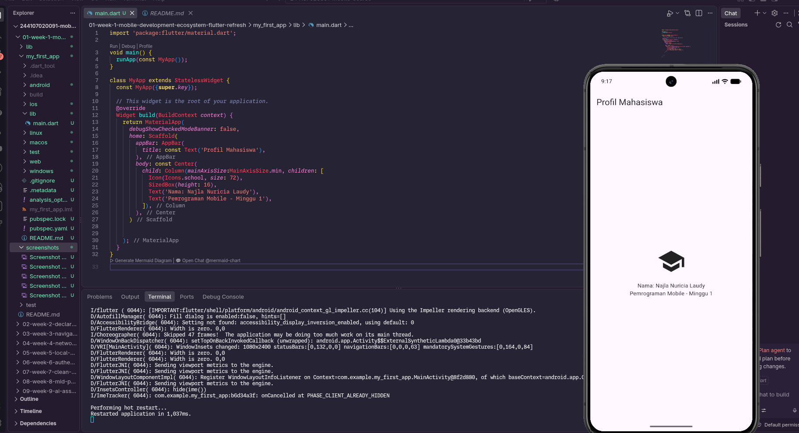
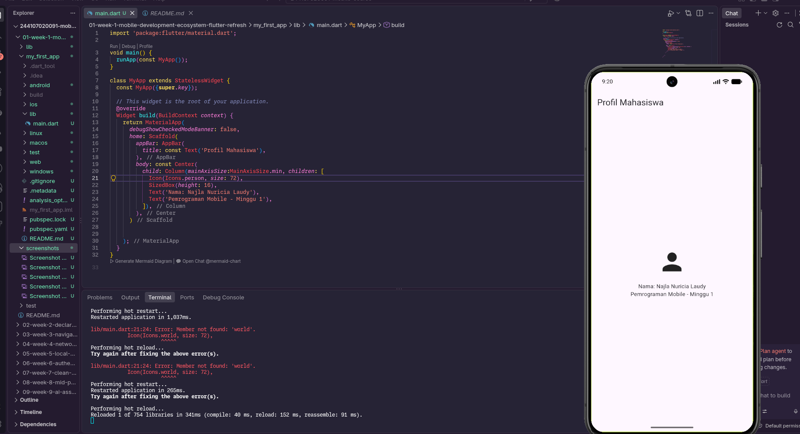
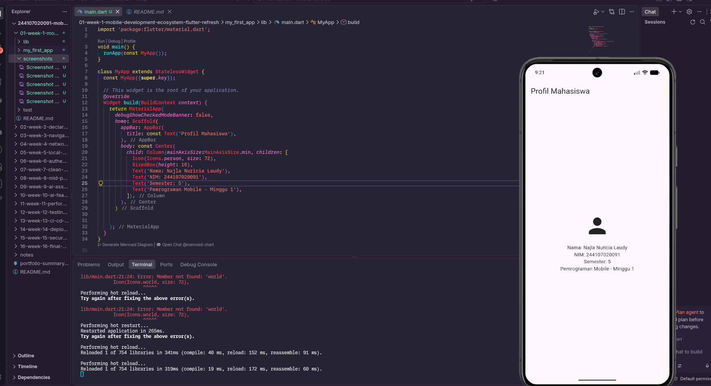

# Minggu 1 — Mobile Development Ecosystem & Flutter Refresh

Nama : Najla Nuricia Laudy\
Kelas : TI-3F\
NIM : 244107020091

## Tujuan

Praktikum minggu pertama bertujuan untuk memahami  dasar pengembangan aplikasi mobile menggunakan Flutter dan Dart. Kegiatan yang dilakukan meliputi instalasi dan pengecekan Flutter, mempelajari dasar bahasa Dart dan null safety, menjalankan aplikasi Flutter pertama, mencoba hot reload dan hot restart, serta membuat aplikasi sederhana berupa Profil Mahasiswa.

## Fitur Utama

* Instalasi dan konfigurasi Flutter.
* Pengecekan environment menggunakan `flutter doctor`.
* Latihan dasar bahasa Dart.
* Implementasi null safety pada Dart.
* Membuat dan menjalankan aplikasi Flutter pertama.
* Menggunakan widget dasar Flutter 
* Menampilkan profil mahasiswa.
* Menambahkan nama, NIM, dan semester.
* Mencoba hot reload dan hot restart.

## Tech Stack

* Flutter
* Dart
* Android Emulator
* Android SDK
* Visual Studio Code
* Git
* GitHub

## Dart Refresh
### Dasar Dart
```dart
void main() {
  String nama = 'Alya';
  int semester = 3;
  final bool aktif = true;

  print(sapa(nama, semester));

  final mahasiswa = Mahasiswa(
    nama: nama,
    aktif: aktif,
  );

  print(mahasiswa.status());
}

String sapa(String nama, int semester) {
  return 'Halo $nama, semester $semester';
}

class Mahasiswa {
  Mahasiswa({
    required this.nama,
    required this.aktif,
  });

  final String nama;
  final bool aktif;

  String status() => aktif ? '$nama aktif' : '$nama tidak aktif';
}
```
#### Hasil

### Tugas
```dart
void main() {
  double panjang = 10;
  double lebar = 5;
  print('Luas persegi panjang: ${hitungLuas(panjang, lebar)}');

  final profil = Profil(
    nama: 'najla Nuricia Laudy',
    nim: 244107020091,
    email: null,
  );

  print(profil.perkenalan());
}

double hitungLuas (double panjang, double lebar) {
  return panjang * lebar;
}

class Profil {
  Profil({
    required this.nama,
    required this.nim,
    required this.email,
  });

  final String nama;
  final int nim;
  final String? email;

  String perkenalan() => 'Halo, nama saya $nama dan nim saya $nim';
}
```
#### Hasil



---

# Praktikum Aplikasi Flutter Pertama


## Hot Reload dan Hot Restart

Pada praktikum dilakukan perubahan terhadap teks dan icon pada aplikasi untuk melihat perbedaan antara hot reload dan hot restart.

### Hot Reload

Hot reload biasa digunakan untuk restat tampilan.

Dilakukan dengan menekan:

```text
r
```

### Hot Restart

Hot restart menjalankan ulang aplikasi Flutter dari awal

Dilakukan dengan menekan:

```text
R
```


---

# Kendala Setup

* Saat sudah berhasil install flutter dan add path otomatis, tetapi di nu shell flutter belum terdefinisi jadi add path ulang menggunakan nano
* Proses download yang cukup lama
* Waktu pertamakali kebingungan mana yang harus di install terlebih dahulu

# Hasil yang Dicapai

Setelah menyelesaikan praktikum, hasil yang berhasil dicapai adalah:

* Flutter berhasil terinstal dan dapat dijalankan.
* Environment Flutter berhasil diperiksa menggunakan `flutter doctor`.
* Emulator berhasil dikenali oleh Flutter.
* Memahami syntax dasar Dart.
* Memahami penggunaan `final`, function, dan class pada Dart.
* Memahami konsep null safety.
* Berhasil membuat project Flutter pertama.
* Berhasil menjalankan aplikasi Flutter melalui emulator.
* Berhasil menggunakan hot reload dan hot restart.
* Berhasil mengubah UI bawaan Flutter.
* Berhasil membuat aplikasi Profil Mahasiswa menggunakan widget dasar Flutter.
* Berhasil menambahkan NIM dan semester pada aplikasi.

## Screenshot Hasil

### Pengecekan Flutter Doctor




### Aplikasi Flutter Berhasil Diinstall





### Profil Mahasiswa



### Profil Mahasiswa Ganti Icon


### Profil Mahasiswa Tambah Widget Informasi



---

# Refleksi

## 1. Kapan native lebih tepat dipilih daripada cross-platform?

Ketika memiliki fitur yang sangat spesifik, butuh performa tinggi, seperti aplikasi yang banyak memakai Bluetooth, NFC, sensor, atau background service.

## 2. Bagaimana perubahan state berhubungan dengan widget tree dan UI deklaratif?

Flutter menggunakan UI deklaratif, yaitu kita hanya perlu mengubah datanya agar tampilan tersebut update

## 3. Mengapa commit kecil dengan pesan jelas bermanfaat bagi pekerjaan tim dan portfolio?

karena comit kecil dan jelas memudahkan developer tracking apabila terjadi masalah atau perubahan baru. Memudahkan untuk checking fitur yang sudah di implemenasi dan belum.

---

# Kesimpulan

Pada praktikum minggu pertama telah dilakukan instalasi dan pengecekan environment Flutter, latihan dasar Dart dan null safety, pembuatan aplikasi Flutter pertama, serta implementasi aplikasi Profil Mahasiswa.
