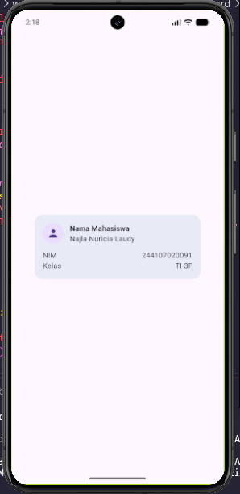
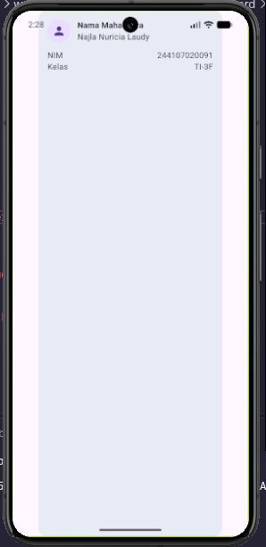
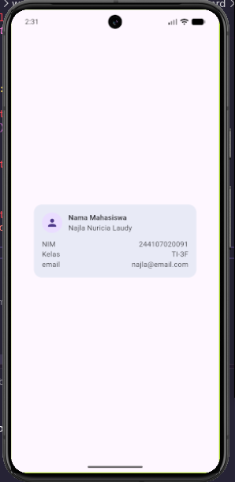
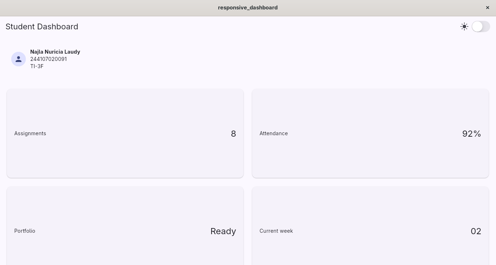
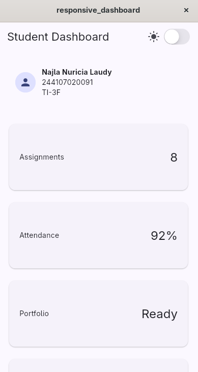
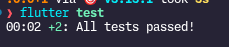
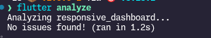

# Minggu 2 — Declarative UI & Responsive Design

Nama : Najla Nuricia Laudy\
Kelas : TI-3F\
NIM : 244107020091

## Tujuan

Menjelaskan prinsip declarative UI dan hubungan antara widget, konfigurasi, serta state.
Menggunakan StatelessWidget, StatefulWidget, Container, Row, Column, dan Expanded.
Membedakan komponen Material 3 dan Cupertino untuk kebutuhan platform yang berbeda.
Membangun layout responsif untuk ukuran layar mobile dan tablet.
Menerapkan theme, dark mode, styling, dan aksesibilitas dasar.

## Layout sederhana




## Dokumentasi Pengembangan Dashboard

### 1. Perbandingan Layout

**Prompt:**
Bandingkan penggunaan `GridView` dengan `LayoutBuilder` + `Column` untuk dashboard akademik.

**Hasil:**
`GridView` cocok untuk menampilkan kumpulan kartu secara teratur, sedangkan `LayoutBuilder` dapat digunakan untuk menyesuaikan layout berdasarkan lebar layar.

**Keputusan:**
Menggunakan `LayoutBuilder` dan `GridView`. Pada layar dengan lebar kurang dari 700px digunakan 1 kolom, sedangkan layar yang lebih lebar menggunakan 2 kolom.

```dart
final columns = constraints.maxWidth >= 700 ? 2 : 1;
```

**Alasan:**
Layout tetap nyaman digunakan pada layar HP maupun layar yang lebih lebar.

---

### 2. Penggunaan Expanded

**Prompt:**
Kapan penggunaan `Expanded` dapat menyebabkan masalah overflow di dalam `Row`?

**Hasil:**
`Expanded` membantu child menggunakan sisa ruang pada `Row`. Namun, masalah dapat terjadi jika isi tetap membutuhkan ruang lebih besar dari ruang yang tersedia, misalnya karena ukuran tetap atau teks yang terlalu panjang.

**Keputusan:**
Menggunakan `Expanded` pada bagian yang perlu menyesuaikan ruang dan menghindari ukuran `width` tetap yang tidak diperlukan.

```dart
Row(
  children: [
    Expanded(
      child: Text('Assignments'),
    ),
    Text('8'),
  ],
)
```

---

### 3. Responsivitas dan Aksesibilitas

**Prompt:**
Periksa apakah layout tetap responsif di bawah 600px dan apakah terdapat masalah aksesibilitas atau widget yang tidak tersedia di Flutter stable.

**Hasil:**
Layout tetap menggunakan 1 kolom pada layar di bawah 600px. Widget yang digunakan tersedia pada Flutter stable.

Untuk membantu screen reader, switch mode gelap diberikan `Semantics`.

```dart
Semantics(
  label: isDark
      ? 'Nonaktifkan mode gelap'
      : 'Aktifkan mode gelap',
  child: CupertinoSwitch(
    value: isDark,
    onChanged: onDarkChanged,
  ),
)
```

## Dasboard Responsive


## Tugas



# Refleksi
### 1. Imperative vs Declarative
Imperative mengatur langkah perubahan tampilan satu per satu, sedangkan declarative cukup menentukan tampilan yang diinginkan berdasarkan kondisi atau data saat ini.

### 2. Penggunaan `Expanded`
`Expanded` membantu widget mengisi ruang kosong yang tersedia. Namun, penggunaannya bisa menyebabkan error jika ditempatkan pada layout yang tidak memberikan batas ruang yang jelas.

### 3. Breakpoint dan Theme
Breakpoint membuat tampilan menyesuaikan ukuran layar, misalnya satu kolom di HP dan dua kolom di layar lebar. Theme membuat warna dan tampilan aplikasi dapat menyesuaikan mode terang atau gelap.

### 4. Verifikasi Rekomendasi AI
Saya memeriksa kembali apakah kode dari AI dapat dijalankan, sesuai dengan kebutuhan tugas, dan tidak menghasilkan error.

# Kesimpulan

Pada praktikum ini membuat UI Flutter secara declarative, mengatur layout menggunakan widget seperti Row, Column, dan Expanded, serta membuat tampilan responsif dengan breakpoint. Mempelajari penggunaan theme terang dan gelap serta melakukan pengujian untuk memastikan tampilan berjalan sesuai kebutuhan.