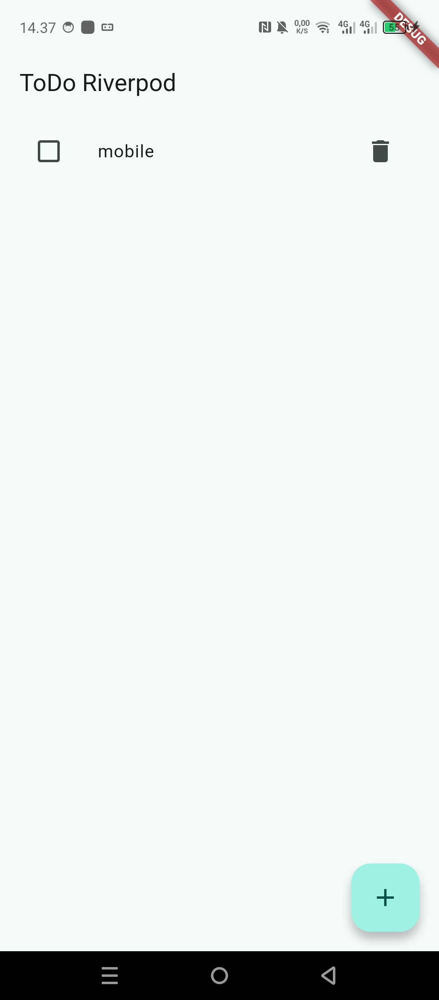
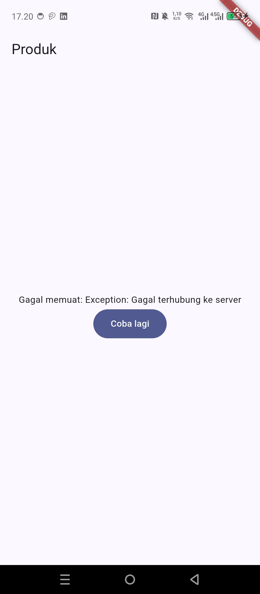
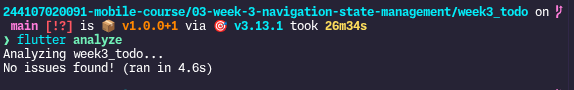
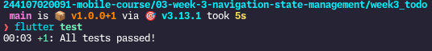

# Minggu 3 — Navigation & State Management

Nama : Najla Nuricia Laudy\
Kelas : TI-3F\
NIM : 244107020091

## Tujuan

menjelaskan konsep navigasi, route, dan perbedaan Navigator 1.0 dengan GoRouter;
menerapkan navigasi multi-page dengan GoRouter, termasuk passing argument dan deep link sederhana;
menjelaskan mengapa state management diperlukan dan cara kerja Riverpod (Provider, ConsumerWidget, Notifier);
menggunakan AsyncValue untuk menangani state loading, error, dan success pada UI;
membangun aplikasi ToDo dengan navigasi dan Riverpod, lalu memverifikasi hasilnya dengan widget test sederhana.

# Konsep navigasi go router

# State management dengan Riverpod

# AsyncValue: loading, error, success

# AI Chalenge
```Buatkan halaman Flutter bernama StatsPage menggunakan flutter_riverpod.
Requirements:
- ConsumerWidget dengan satu AsyncNotifierProvider yang mensimulasikan
  pengambilan data statistik (delay 2 detik, kadang gagal 30%).
- UI harus menangani loading (spinner), error (pesan + tombol retry),
  dan success (ListView 3 item).
- Berikan unit test untuk notifier-nya.
Jelaskan setiap bagian kode dalam komentar.
```
## Evaluasi Kode StatsPage dengan Riverpod

### 1. Apakah state diubah secara immutable?

**Ya**

```dart
Future<void> retry() async {
  state = const AsyncLoading();

  state = await AsyncValue.guard(_fetchStats);
}
```


---

### 2. Apakah `ref.watch` hanya dipakai di dalam `build`, dan `ref.read` di callback?

**Ya**

`ref.watch` di dalam `build`

```dart
@override
Widget build(BuildContext context, WidgetRef ref) {
  final statsAsync = ref.watch(statsProvider);
}
```

`ref.read` di dalam callback

```dart
FilledButton(
  onPressed: () {
    ref.read(statsProvider.notifier).retry();
  },
  child: const Text('Coba lagi'),
)
```

---

### 3. Apakah ketiga state `AsyncValue` benar-benar ditangani?

**Ya**

Loading

```dart
loading: () => const Center(
  child: CircularProgressIndicator(),
),
```

Error

```dart
error: (error, stackTrace) {
  return Center(
    child: Column(
      mainAxisSize: MainAxisSize.min,
      children: [
        Text('Terjadi error: $error'),
        FilledButton(
          onPressed: () {
            ref.read(statsProvider.notifier).retry();
          },
          child: const Text('Coba lagi'),
        ),
      ],
    ),
  );
},
```

Success

```dart
data: (stats) {
  return ListView.builder(
    itemCount: stats.length,
    itemBuilder: (context, index) {
      return ListTile(
        title: Text(stats[index]),
      );
    },
  );
},
```
---

### 4. Apakah provider dideklarasikan dengan tipe eksplisit dan tidak duplikat?

**Tidak**

```dart
final statsProvider =
    AsyncNotifierProvider<StatsNotifier, List<String>>(
  StatsNotifier.new,
);
```

---

### 5. Apakah kode menggunakan API Riverpod versi lama?

**Tidak**

```dart
class StatsNotifier extends AsyncNotifier<List<String>>
```

```dart
AsyncNotifierProvider<StatsNotifier, List<String>>
```

```dart
class StatsPage extends ConsumerWidget
```
---

### 6. Apakah `flutter analyze` dan `flutter test` lolos?


# Refactoring dan testing
### Pisahkan widget bar ToDo menjadi TodoTile tersendiri agar build lebih pendek dan mudah diuji.
```import 'package:flutter/material.dart';
import '../providers/todo_provider.dart';

class TodoTile extends StatelessWidget{
  const TodoTile({
    super.key,
    required this.todo,
    required this.onToggle,
    required this.onDelete,
  });

  final Todo todo;
  final VoidCallback onToggle;
  final VoidCallback onDelete;

  @override
  Widget build(BuildContext context) {
    return ListTile(
      leading: Checkbox(value: todo.done, onChanged: (_)=> onToggle(),),
      title: Text(
        todo.title,
        style: TextStyle(
          decoration: todo.done ? TextDecoration.lineThrough : null,
        ),
      ),
      trailing: IconButton(
        icon: const Icon(Icons.delete),
        onPressed: onDelete,
      ),
    );
  }
}
```

### Ekstrak logika filter (misal tampilkan hanya yang belum selesai) menjadi Provider turunan yang membaca todoListProvider.
```import 'package:flutter_riverpod/flutter_riverpod.dart';
import 'todo_provider.dart';

final unfinishedTodosProvider = Provider<List<Todo>>((ref) {
  // digunakan untuk melihat isi kotak berubah atau enggak
  final todos = ref.watch(todoListProvider);
  //untuk return yang belum selesai
  return todos.where((todo) => !todo.done).toList();
});
```

### Integrasikan aplikasi ToDo dengan GoRouter: / untuk daftar dan /stats untuk halaman statistik, tambahkan NavigationBar untuk berpindah.
```import 'package:go_router/go_router.dart';
import '../providers/todo_page.dart';
import '../providers/stats_page.dart';
import '../providers/navbar.dart';

final router = GoRouter(
  initialLocation: '/',
  routes: [
    ShellRoute(
      builder: (context, state, child) {
        return Navbar(
          location: state.uri.path,
          child: child,
        );
      },
      routes: [
        GoRoute(
          path: '/',
          builder: (context, state) => const TodoPage(),
        ),
        GoRoute(
          path: '/stats',
          builder: (context, state) => const StatsPage(),
        ),
      ],
    ),
  ],
);
```
```import 'package:flutter/material.dart';
import 'package:go_router/go_router.dart';

class Navbar extends StatelessWidget {
  const Navbar({
    super.key,
    required this.child,
    required this.location,
  });

  final Widget child;
  final String location;

  @override
  Widget build(BuildContext context) {
    final selectedIndex = location == '/stats' ? 1 : 0;

    return Scaffold(
      body: child,
      bottomNavigationBar: NavigationBar(
        selectedIndex: selectedIndex,
        onDestinationSelected: (index) {
          if (index == 0) {
            context.go('/');
          } else {
            context.go('/stats');
          }
        },
        destinations: const [
          NavigationDestination(
            icon: Icon(Icons.check_box_outlined),
            label: 'ToDo',
          ),
          NavigationDestination(
            icon: Icon(Icons.bar_chart),
            label: 'Statistik',
          ),
        ],
      ),
    );
  }
}
```


# Tugas


# Refleksi
### Kapan setState masih cukup, dan kapan state harus naik ke Riverpod?
setstate masih cukup kalau data dipaai di widget kecil, misal buka tutup password, kalau datana banyak seperti todo list pake riverpod
### Apa perbedaan context.go dan context.push, dan kapan masing-masing tepat digunakan?
context.go pindah ke halaman baru , context.push cocok digunakan untuk halaman detail karena ada tombol back nya 
### Bagaimana AsyncValue mencegah bug dibanding tiga boolean terpisah?
AsyncValue membuat state lebih rapi karena hanya ada satu kondisi dalam satu waktu
### Bagian mana dari hasil AI yang Anda perbaiki, dan mengapa?
saya benarikan index toggle nya , karena kalau pake yang lama itu aneh, udah di toggle selesai dipencet di tempat yang sama muncul lagi.
