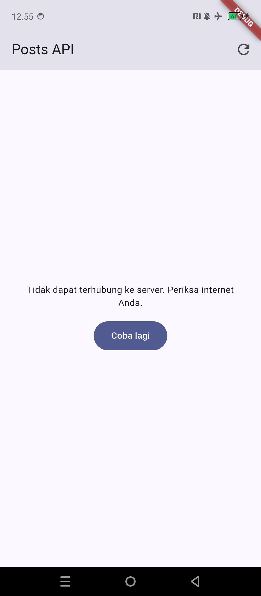
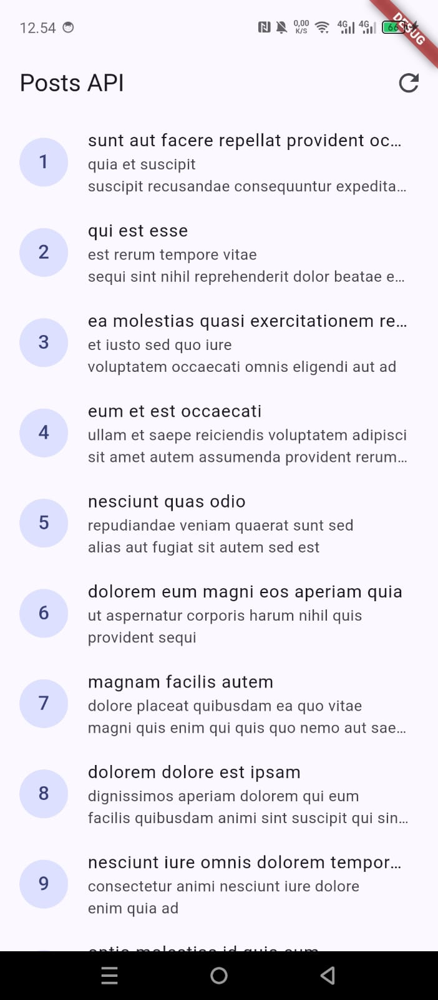

# Minggu 4 — Networking & REST API

Nama : Najla Nuricia Laudy\
Kelas : TI-3F\
NIM : 244107020091

## Tujuan

enjelaskan konsep HTTP, REST API, dan JSON;
memetakan JSON ke model Dart (serialization) dengan aman null;
menerapkan repository pattern dasar sehingga UI tidak memanggil API secara langsung;
mengonfigurasi Dio (base URL, timeout, interceptor) dan menangani error jaringan;
menampilkan state loading, error, empty, dan success pada UI dengan AsyncValue + Riverpod;
menerapkan pagination dasar (infinite scroll).

# AI Chalenge
Apakah UI memanggil Dio secara langsung (dilarang) atau lewat repository? ya 

Apakah fromJson aman null, atau masih memakai cast langsung yang bisa crash? aman null

Apakah semua tipe DioExceptionType (timeout, connectionError, badResponse) dipetakan ke pesan pengguna? ya

Apakah baseUrl/timeout terpusat di satu client, bukan tersebar di tiap method? terpusat

Apakah test AI benar-benar menguji kasus field hilang, atau hanya happy path? edge case

Jalankan flutter analyze dan flutter test, apakah hasil AI lolos tanpa warning? ya

# Tugas

# Refleksi

### Mengapa UI dilarang memanggil Dio langsung? Apa yang rusak jika aturan ini dilanggar?
UI tidak boleh memanggil Dio langsung supaya kode UI dan pengambilan data tidak tercampur. Kalau dilanggar, kode jadi susah dirawat dan susah dites.

### Kapan pagination client-side cukup, dan kapan harus mengandalkan pagination server (`_page`/`_limit`)?
Pagination client-side cukup kalau datanya sedikit dan semua data sudah diambil. Kalau datanya banyak, lebih baik pakai pagination server supaya tidak mengambil semua data sekaligus.

### Bagaimana exception repository berubah menjadi `AsyncError` tanpa try/catch di setiap widget? Kapan try/catch eksplisit tetap dibutuhkan?
Kalau repository error, Riverpod bisa mengubah error tersebut menjadi `AsyncError`, jadi widget cukup menangani kondisi loading, data, dan error lewat `AsyncValue`. Try/catch tetap dibutuhkan kalau error ingin ditangani secara khusus, misalnya menampilkan pesan tertentu atau menjalankan aksi lain saat gagal.

### Bagian mana dari hasil AI yang Anda perbaiki, dan mengapa?
tidak ada,karena sudah sesuai perintah