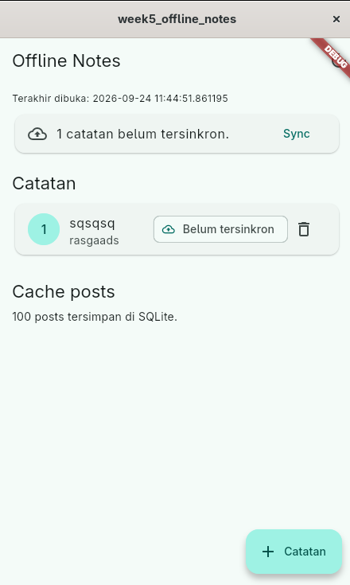
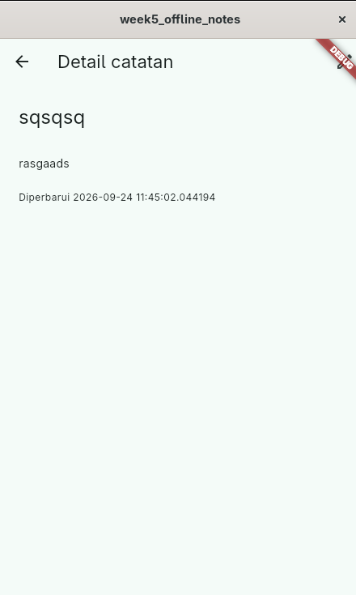

# Week 5: Local Storage dan Offline-First

## Audit terhadap rancangan AI

### 1. Apakah daftar catatan ditempatkan di SharedPreferences?

Tidak.

### 2. Apakah schema mendukung antrean sync?

Ya, mekanismenya sudah lebih dari CRUD polos.

### 3. Apakah klaim "real-time" didukung stream?

Belum.

### 4. Apakah estimasi boilerplate masuk akal setelah instalasi?

masuk akal

## Perbandingan teknologi

| Kriteria           | SharedPreferences               | Hive                                      | sqflite / SQLite                      | Drift                                |
| ------------------ | ------------------------------- | ----------------------------------------- | ------------------------------------- | ------------------------------------ |
| Kompleksitas query | Key-value saja                  | Key-value dan filter sederhana            | SQL lengkap, sort, filter, pagination | SQL type-safe melalui Dart API       |
| Kebutuhan relasi   | Tidak cocok                     | Relasi manual                             | JOIN dan foreign key                  | JOIN dan relasi terstruktur          |
| Reaktivitas        | Tidak ada stream database       | `box.watch()` tersedia                    | Tidak otomatis; perlu wrapper         | `watch()` tersedia secara native     |
| Type-safety        | Rendah, nilai tipe dasar        | Menengah, perlu adapter untuk object      | Mapping manual dari `Map`             | Tinggi, query menghasilkan tipe Dart |
| Ukuran boilerplate | Sangat kecil                    | Kecil-menengah                            | Menengah                              | Menengah-besar                       |
| Kemudahan testing  | Mudah di-mock                   | Cukup mudah                               | Baik dengan database test/in-memory   | Sangat baik dengan database test     |
| Trade-off utama    | Tidak cocok untuk koleksi besar | Query dan migrasi kompleks lebih terbatas | SQL dan mapping harus dikelola manual | Setup dan generated code lebih berat |

## Rekomendasi final

| Kebutuhan                                    | Rekomendasi           | Alasan                                                                                       |
| -------------------------------------------- | --------------------- | -------------------------------------------------------------------------------------------- |
| Preferensi tema dan pengaturan kecil         | **SharedPreferences** | Data sedikit, key-value, tidak memerlukan query, relasi, atau stream                         |
| Catatan offline CRUD 1000+ item              | **sqflite / SQLite**  | Mendukung indexing, pencarian, sorting, transaksi, pagination, dan migrasi                   |
| Catatan dengan stream dan type-safety tinggi | **Drift**             | Lebih cocok bila aplikasi membutuhkan query reaktif, banyak tabel, dan skema yang berkembang |

### Screenshot

