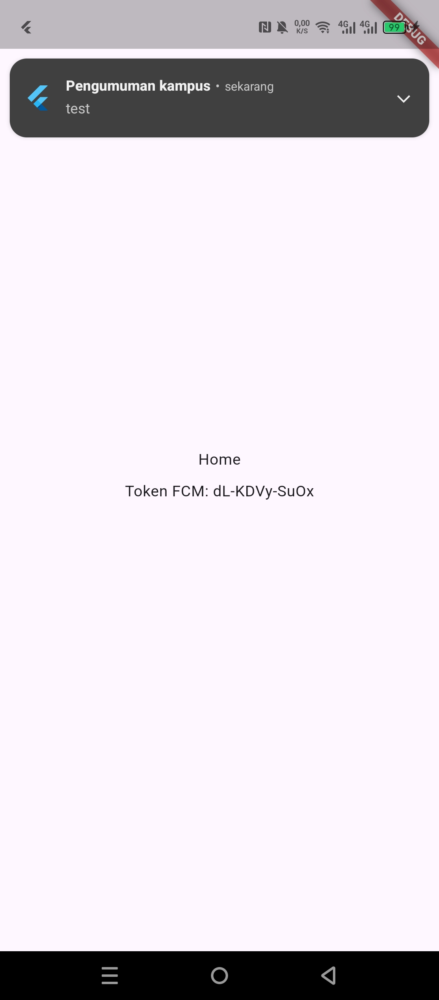
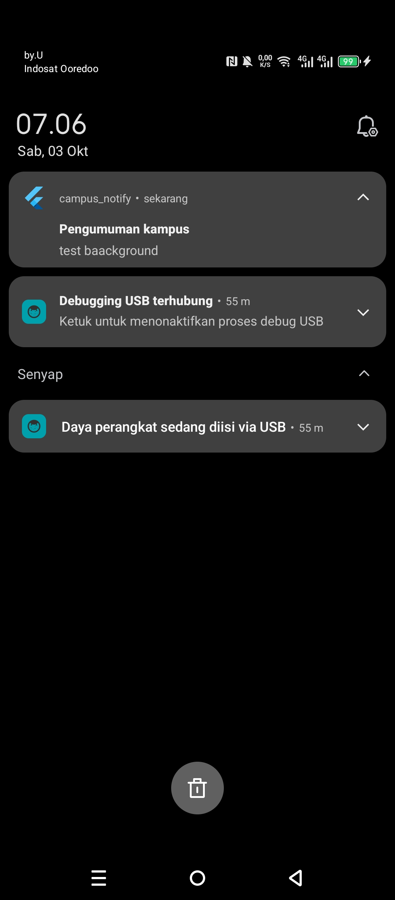
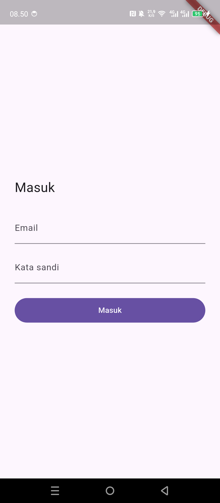
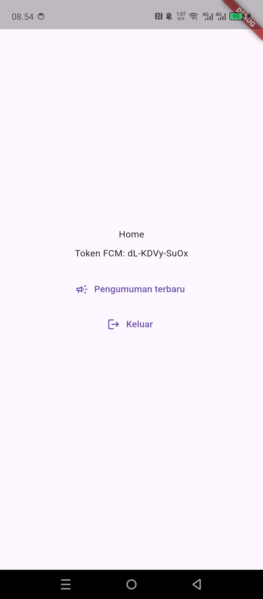

# Authentication, Security & FCM

Nama : Najla Nuricia Laudy\
Kelas : TI-3F\
NIM : 244107020091

## Uji Tiga State

Gunakan pesan notification + data yang sama pada setiap percobaan:
Gunakan pesan notification + data yang sama pada setiap percobaan:

| State      | Cara uji                                                     | Hasil yang diharapkan                                             | Status uji runtime     |
| ---------- | ------------------------------------------------------------ | ----------------------------------------------------------------- | ---------------------- |
| Foreground | Buka aplikasi, kirim pesan, lalu tekan banner lokal.         | Banner lokal muncul dan membuka `/pengumuman/3`.                  | Berhasil |
| Background | Tekan Home, kirim pesan, lalu tekan banner sistem.           | Aplikasi kembali dan membuka `/pengumuman/3`.                     | Berhasil |
| Terminated | Swipe-close aplikasi, kirim pesan, lalu tekan banner sistem. | Aplikasi terbuka dan `getInitialMessage` membuka `/pengumuman/3`. | Berhasil |

### Bukti Screenshot

#### Foreground

#### Background

#### Terminated

# Hasil yang Dicapai

## Login

## Home dan Token FCM

## Tujuan Deep Link

## Refleksi

### Refresh Token dan SharedPreferences

`SharedPreferences` menyimpan nilai biasa dan tidak mengenkripsi refresh token. Jika token tersalin dari backup yang tidak aman, perangkat yang sudah di-root, atau perangkat lunak berbahaya, orang lain bisa memakainya untuk meminta access token baru dan menyamar sebagai pengguna sampai token dicabut atau kedaluwarsa. Simpan token di `flutter_secure_storage`, yang memakai penyimpanan aman sistem operasi.

### Jika `onTokenRefresh` Diabaikan

FCM dapat mengganti token, misalnya setelah aplikasi dipasang ulang atau token lama dicabut. Jika aplikasi tidak mengirim token baru ke backend, server terus mengirim ke token lama. FCM dapat menolak token tersebut dan mahasiswa bisa tidak menerima pengumuman sepanjang semester. Karena itu setiap nilai baru dari `onTokenRefresh` perlu didaftarkan lagi ke `POST /devices`.

### Topic atau Token Perangkat

- **Topic** dipakai untuk pesan umum ke banyak pelanggan. Contoh: kirim “Perubahan jadwal kuliah minggu ini” ke topic `pengumuman-kampus`.
- **Token perangkat** dipakai untuk memilih satu instalasi aplikasi tertentu. Contoh: beri tahu perangkat pengguna bahwa “Pengajuan dispensasi Anda sudah diproses”. Pesan pribadi sebaiknya tidak memuat rincian sensitif; aplikasi dapat mengambil rinciannya setelah dibuka.

### Koreksi atas Draf AI
tidak ada