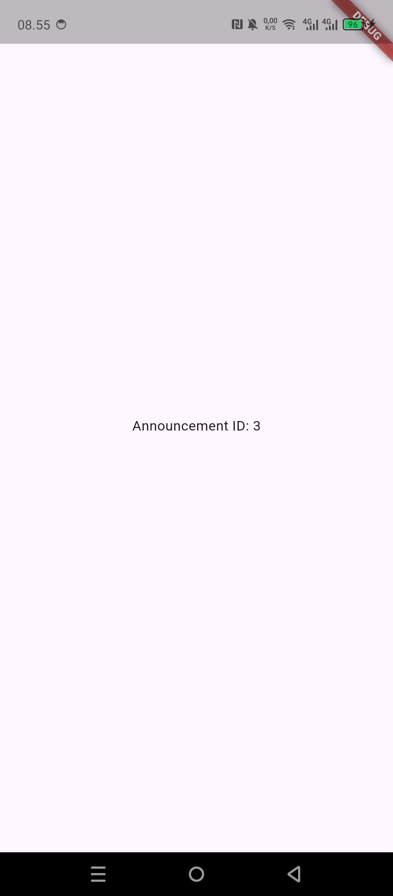

# Week 7 — Clean Architecture

**Nama:** Najla Nuricia Laudy
**Kelas:** TI-3F
**NIM:** 244107020091

## Tujuan

Praktikum ini bertujuan merapikan proyek Flutter `campus_notify` dari Minggu 5/6 menggunakan Clean Architecture. Materi mencakup prinsip SOLID, separation of concerns, struktur feature-first dan layer-first, serta pemisahan presentation, domain, dan data.

## Struktur Proyek

```text
campus_notify/lib/
├── core/
│   ├── failures.dart
│   └── network/
│       ├── api_client.dart
│       └── api_errors.dart
├── features/
│   ├── auth/
│   │   ├── domain/
│   │   ├── data/
│   │   └── presentation/
│   ├── announcements/
│   │   ├── domain/
│   │   ├── data/
│   │   └── presentation/
│   └── notifications/
│       ├── data/
│       └── presentation/
├── main.dart
└── routes.dart
```

## Prinsip Clean Architecture

Clean Architecture membagi aplikasi menjadi tiga layer:

* **Presentation:** Mengatur tampilan dan interaksi pengguna.
* **Domain:** Menyimpan aturan bisnis, entity, kontrak repository, dan use case.
* **Data:** Mengelola API, penyimpanan, model, dan implementasi repository.

Dependensi mengarah ke dalam. Domain tidak bergantung pada UI atau teknologi penyimpanan. Repository menghubungkan kebutuhan domain dengan sumber data, use case menjalankan suatu tindakan aplikasi, dan dependency injection menyediakan implementasi yang dibutuhkan melalui Riverpod.

Entity merepresentasikan konsep bisnis, sedangkan model menangani bentuk data dan proses konversinya. Pemisahan ini membantu menerapkan SOLID dan separation of concerns agar kode lebih mudah diuji dan dirawat.

## SOLID dan Separation of Concerns

| Prinsip               | Penerapan                                                           |
| --------------------- | ------------------------------------------------------------------- |
| Single Responsibility | Setiap bagian memiliki tugas masing-masing.                         |
| Open/Closed           | Implementasi repository dapat diganti tanpa mengubah use case.      |
| Liskov Substitution   | Repository palsu dapat digunakan untuk pengujian sesuai kontraknya. |
| Interface Segregation | Kontrak repository hanya menyediakan operasi yang dibutuhkan.       |
| Dependency Inversion  | Domain bergantung pada kontrak, bukan implementasi teknis.          |

Separation of concerns memisahkan tampilan, aturan bisnis, dan akses data agar perubahan pada satu bagian tidak banyak memengaruhi bagian lainnya.

## Feature-First vs Layer-First

| Feature-first                                                        | Layer-first                                                                       |
| -------------------------------------------------------------------- | --------------------------------------------------------------------------------- |
| Kode dikelompokkan berdasarkan fitur, lalu dipisahkan menjadi layer. | Kode dikelompokkan berdasarkan jenis layer secara global.                         |
| Perubahan fitur lebih terlokalisasi dan mudah dikembangkan.          | Sederhana untuk aplikasi kecil, tetapi kode satu fitur tersebar di banyak folder. |
| Cocok untuk proyek dengan banyak fitur.                              | Cocok untuk proyek sederhana.                                                     |

Proyek ini menggunakan feature-first karena memiliki fitur auth, announcements, dan notifications.

## Hasil Refactor

* Memisahkan kode berdasarkan fitur dan layer.
* Memisahkan kontrak repository dari implementasinya.
* Memindahkan mapping data ke model.
* Menggunakan Riverpod untuk dependency injection.
* Menguji use case announcements menggunakan repository palsu tanpa database atau jaringan sungguhan.

## Fitur Utama

* **Auth:** Login dan pengelolaan sesi.
* **Announcements:** Menampilkan detail pengumuman melalui route `/pengumuman/3`.
* **Notifications:** Integrasi Firebase Messaging.

## Stack Teknologi

* Flutter dan Dart
* Riverpod
* GoRouter
* Dio
* Flutter Secure Storage
* Firebase Messaging
* Flutter Test

## Cara Menjalankan

Jalankan perintah berikut dari folder proyek:

```sh
flutter pub get
flutter run
```

Untuk menjalankan pengujian use case:

```sh
flutter test test/features/announcements/domain/usecases/get_announcement_by_id_test.dart
```

Konfigurasi Firebase harus tersedia sebelum menjalankan aplikasi.

## Hasil Pengujian

Pengujian use case menggunakan repository palsu berhasil dengan **2 test lulus**, mencakup skenario sukses dan kegagalan. Route `/pengumuman/3` tetap menampilkan detail dengan ID `3`.

Pemeriksaan juga dilakukan untuk memastikan domain tidak mengimpor dependensi teknis, mapping data berada di layer data, dan halaman presentation tidak mengakses jaringan atau penyimpanan secara langsung.

## Screenshot Sebelum dan Sesudah

| Sebelum refactor                                                                     | Sesudah refactor                                                                    |
| ------------------------------------------------------------------------------------ | ----------------------------------------------------------------------------------- |
|  |  |
